# ⚡️ RAG API with Local LLM

> A lightweight, containerized **Retrieval-Augmented Generation (RAG)** API built with **FastAPI**, **ChromaDB**, and **Ollama**. Optimized for AMD Linux platforms.

<div align="center">


</div>

---

## 📖 Overview

This project provides a self-contained RAG solution that runs entirely within a Docker container. It combines a high-performance vector database with a local Large Language Model (LLM) to answer queries based on your custom documentation.

### ✨ Key Features
-   **Self-Contained**: Ollama and the LLM run *inside* the container—no external dependencies.
-   **Lightweight**: Uses `python:3.11-slim` and **TinyLlama** (~600MB model).
-   **Auto-Embedding**: Automatically ingests content from `django.txt` on startup.
-   **Platform Ready**: Optimized for `linux/amd64` (Standard Servers / Intel / AMD).

---

## 🏗 Architecture & Flow

The application follows a streamlined flow to process user queries using local context.

```mermaid
graph TD
    User([User / Client])
    
    subgraph "🐳 Docker Container"
        API[⚡️ FastAPI Server]
        Embed[📄 embed.py Script]
        
        subgraph "🧠 AI / ML"
            Chroma[(🟣 ChromaDB)]
            Ollama[🦙 Ollama Service]
            Model[📦 TinyLlama Model]
        end
        
        Docs[📄 django.txt]
    end

    %% Flow
    User -->|"POST /query"| API
    API -->|"1. Search Context"| Chroma
    Chroma --x|"2. Return Top K Docs"| API
    API -->|"3. Prompt (Context + Query)"| Ollama
    Ollama <-->|Inference| Model
    Ollama -->|"4. Generated Answer"| API
    API -->|"5. JSON Response"| User

    %% Initialization
    Docs -.->|"Read on Startup"| Embed
    Embed -.->|"Create/Update DB"| Chroma
```



---

## 🚀 Getting Started

### Prerequisites
-   **Docker** installed on your machine.

### 🛠 Installation & Running

The setup is simplified to a standard Docker build and run. The container will automatically execute `embed.py` to create the ChromaDB database from your documents.

**1. Build the Image**
```bash
docker build -t ragapi .
```

**2. Run the Container**
```bash
docker run -p 3000:3000 ragapi
```
> **Note**: On the very first run, the container will automatically download the `tinyllama` model. This may take a minute depending on your internet connection.

---

## 🔌 API Endpoints

| Method | Endpoint | Description |
| :--- | :--- | :--- |
| `GET` | `/` | Serves the simple static UI for testing. |
| `POST` | `/query` | **Main RAG Endpoint**. Accepts user questions and returns context-aware answers. |
| `POST` | `/generate` | Direct LLM access (no context injection). |

---

## 📂 Project Structure

```bash
.
├── Dockerfile              # Multi-stage optimized build
├── docker-entrypoint.sh    # Startup manager (Ollama > Model > App)
├── app.py                  # FastAPI application logic
├── embed.py                # Embedding generation script
├── django.txt              # 📄 Source knowledge base (Edit this!)
└── db/                     # Persisted vector database (generated)
```

<div align="center">
    <sub>Built with ❤️ by Antigravity</sub>
</div>
